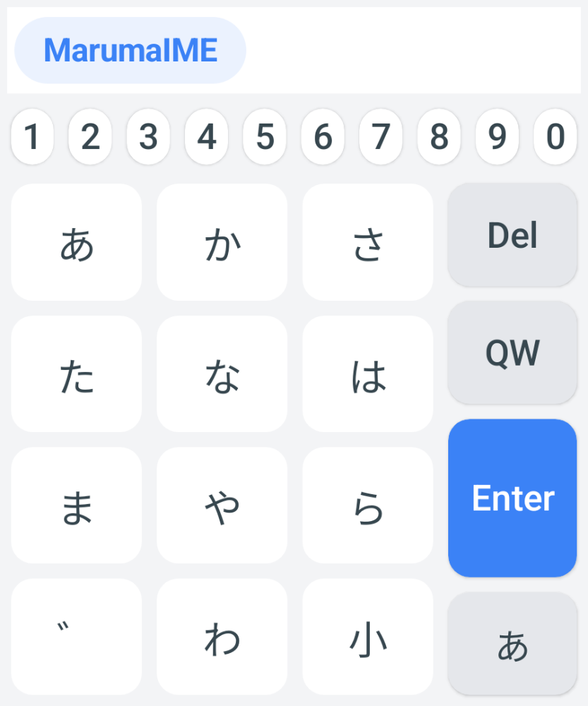

# MarumaIME

Android向けキーボード（IME）プロジェクト。

## プロジェクト構成
- `app/`: メインアプリケーションモジュール。
- `build.gradle.kts`: プロジェクトレベルのビルド設定。
- `settings.gradle.kts`: プロジェクト設定およびモジュール定義。

## はじめに
1. リポジトリをクローンする。
2. Android Studioでプロジェクトを開く。
3. Androidデバイスまたはエミュレータでビルドおよび実行する。
